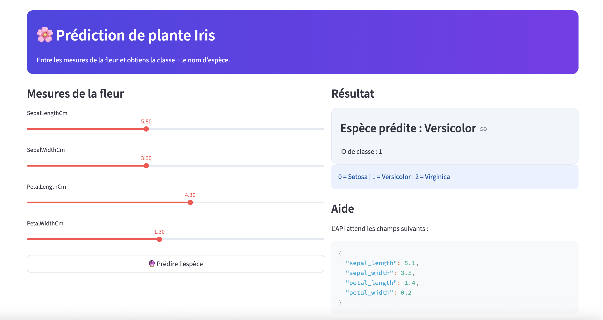

# Pipeline-CI-CD

Un projet complet de pipeline CI/CD avec prédiction d'iris en temps réel.

## Vue d'ensemble



## Description

Ce projet implémente un pipeline CI/CD complet avec:
- **Backend**: API FastAPI pour prédiction de l'espèce d'iris
- **Frontend**: Interface Streamlit pour interaction utilisateur
- **ML**: Modèle RandomForest entrainé sur le dataset Iris
- **Docker**: Conteneurisation et orchestration avec Docker Compose
- **Tests**: Suite de tests avec pytest

## Quick Start

```bash
# Démarrer les services
./run.sh

# Accéder à l'application
http://localhost:8501
```

Pour plus de détails, consultez la [documentation](docs/2.md).
